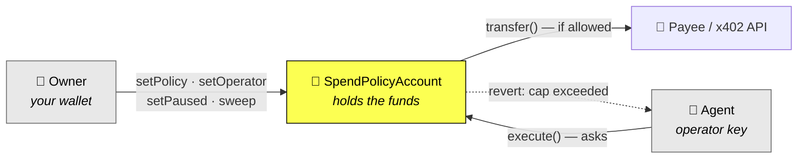

<div align="center">

# Leash

**Give an AI agent a wallet without trusting it.**

Spend limits and payee allowlists enforced on-chain — not by a prompt.

[](LICENSE)
[](https://celoscan.io/)
[](https://celoscan.io/address/0xbe380aa73c036da30d3b2fd5e75b0d1d89e11c3d#code)
[](contracts/src/SpendPolicyAccount.sol)

[Live app](https://leash-app-phi.vercel.app) ·
[Live account](https://leash-app-phi.vercel.app/a/0xBE380aa73c036da30D3b2fd5E75B0d1d89E11C3d) ·
[Contract](https://celoscan.io/address/0xbe380aa73c036da30d3b2fd5e75b0d1d89e11c3d) ·
[Connect an agent](docs/quickstart.md) ·
[Agent setup](docs/mcp-setup.md) ·
[Deployments & proofs](docs/deployments.md)

</div>

---

## The problem

Every "agent wallet" today is a private key in an agent's environment and a
sentence in a system prompt asking it to be careful. That is not a limit. It is
a request — one that a prompt injection, a bad tool result, or an ordinary
hallucination can talk its way past, and one that offers nothing at all once the
key leaks.

**Leash replaces the request with a revert.**

The money never sits in the agent's wallet. It sits in a contract the agent does
not own. The agent can only *ask* that contract to spend, and the contract
refuses past its per-transaction cap, its daily cap, and its optional payee
allowlist. A leaked agent key does not become an unbounded one — it becomes a
key that can spend at most one day's allowance.

Where that allowance can go depends on one switch, which is **off** when an
account is created. With it off, the agent can only pay addresses you named,
and it has no way to move funds into its own wallet at all. Turning it on is
what x402 needs — the agent pays those APIs from its own wallet — and it opens
the one path the allowlist cannot reach: the agent may draw up to the day's
allowance to itself, and spend that anywhere. The caps bind either way; the
allowlist is a complete constraint only while the switch is off.

The limits are bytecode on Celo mainnet. They are not upgradeable, and they are
not ours to change on your behalf.

---

## How it works



Every spend passes four gates, in this order, inside a single transaction:

| # | Gate | Reverts with |
|---|------|--------------|
| 1 | Is the caller a registered operator? | `NotOperator` |
| 2 | Is the account unpaused? | `ContractPaused` |
| 3 | Is the payee allowed (when the allowlist is on)? | `PayeeNotAllowed` |
| 4 | Is the amount within the per-tx **and** daily cap? | `PerTxCapExceeded` · `DailyCapExceeded` |

The daily counter is on-chain state keyed to `block.timestamp / 1 days`, so it
resets at 00:00 UTC and cannot be reset by the agent, by us, or by a redeploy of
the frontend.

**Checking a limit is free.** The SDK runs every spend through `preCheck`, a
`staticcall`, before signing anything. An agent that would exceed its cap learns
so without sending a transaction, paying gas, or leaving a failed hash behind.

---

## What is proven on Celo mainnet

Every row is a transaction you can open. Nothing here is a testnet rehearsal,
and nothing is a claim about what the code *would* do.

| What it proves | Evidence |
|---|---|
| **The policy gates a real spend.** `remainingToday`, the account and the payee each moved by exactly `10000`, read at the block before against the block itself — so the cap governed the transfer rather than merely coexisting with it. | tx: [`0x11cc0100…c8246fc`](https://celoscan.io/tx/0x11cc0100809084880c68b401668dfa46b3eaf32d61bea43fa40ee897dc8246fc) |
| **An agent wallet holding zero CELO still transacts,** paying gas in USDC through Celo's fee abstraction. The operator's CELO balance is `0` before and after every spend below. | [operator `0xd44daF6D…c850D6`](https://celoscan.io/address/0xd44daf6db6c8057c206e6acc27e6384b8ec850d6) |
| **The attribution tag round-trips.** The ERC-8021 suffix decodes to `["celo_3dec652cd977"]` off-chain and again straight from raw chain data. | same tx as above |
| **x402 paid with money drawn through the policy.** The agent paid `16753` for a metered resource and drew `17330` to afford it; `remainingToday` and the account both fell by exactly the draw — the caps apply to agent purchases, not only to plain transfers. | draw tx: [`0xd03c3b26…2baa807`](https://celoscan.io/tx/0xd03c3b264129ba303bc394f8cfbaedad545ca4813b6e0fc6c1a12447d2baa807) · settlement tx: [`0xedd104e3…15865ef`](https://celoscan.io/tx/0xedd104e390d32c0d96b0b1c5e07365e2688344ee4905c3d7f3092d21815865ef) |
| **A real MCP agent spent through the policy.** `leash_pay` called by an agent in a separate session, handed the account and nothing else — no human typed an amount or a payee. `remainingToday`, the account and the payee each moved by exactly `100000`. | tx: [`0x3cb307a4…8148704`](https://celoscan.io/tx/0x3cb307a4fde990a3f9282348999127daf022f4caea264af16426595158148704) |
| **The contract is deployed and source-verified.** 3766 bytes, solc 0.8.24, not a proxy and not upgradeable. The owner can set policy, pause and sweep, and is deliberately *not* an operator — it cannot spend through the agent's paths. Verification confirmed with `forge verify-check`, not inferred from the submission's `OK`. | deploy tx: [`0xad28ee0d…422e7449`](https://celoscan.io/tx/0xad28ee0dc8a25bc9e1896fed8bde1d3dd88804f3f4f93a5eb96c4f32422e7449) |
| **The owner key can be rotated, and the drain path can be shut.** `transferOwnership` nominates, `acceptOwnership` completes, and both branches were exercised by a second real wallet on mainnet — including the old owner being refused afterwards. `topUpOperator` is off at construction until the owner opens it. | tx: [`0xc703cbcd…56499e47`](https://celoscan.io/tx/0xc703cbcd32d37cee69a3fd618cca0f7fc4da4ac11a3150c7fbce210456499e47) · handed back, tx: [`0xe025d7e6…a08dfb157e`](https://celoscan.io/tx/0xe025d7e66bf00c475c716934ab21e4d99714783466c3a8ef20a043a08dfb157e) |

**Every transaction in that table is on the v2 account** —
`0xBE380aa73c036da30D3b2fd5E75B0d1d89E11C3d` — except the x402 settlement,
which is an EIP-3009 transfer the facilitator submits and so names the USDC
token as its target. That is the claim being made about it, not a mismatch.
Each hash was read back off mainnet on 2026-09-16 and returned status `1`.

This paragraph used to say the first four rows were earned on v1 and had been
re-proved elsewhere, which was both stale and wrong in its detail: the spend it
pointed at was on `0x895B773E…`, superseded on 2026-09-03, and the MCP-agent row
was on `0xA73DB76f…`, an account owned by somebody else. The v2 hashes had been
sitting in [`docs/deployments.md`](docs/deployments.md) since v2 landed. They are
in the table now, and `app/lib/proofs.ts` — which the landing page renders from —
carries the same set.

Two outcomes, `spend_reverted` and `sent_unconfirmed`, are covered by unit tests
only and have never been observed on-chain. They are not claimed here.

[`docs/deployments.md`](docs/deployments.md) has the full working: every value
read back off the chain rather than taken from a test's own output, what each
step cost, and an honest record of the run that hit a gateway `500` and how the
chain settled whether the money had actually moved.

---

## Quick start

### Look at it — no wallet required

The dashboard reads Celo mainnet directly. Policy limits, remaining allowance,
balances and the live activity feed all render for a stranger with an empty
browser.

**<https://leash-app-phi.vercel.app/a/0xBE380aa73c036da30D3b2fd5E75B0d1d89E11C3d>**

That is a live account and the numbers on it are real.

### Give your own agent a wallet

**In the browser (recommended).** A four-stage wizard creates *your own*
`SpendPolicyAccount`, sets its protection, authorizes a separate agent wallet,
and funds both the protected budget and the agent's USDC gas float. It marks the
account ready only after all five operating conditions are verified on Celo.
SDK or MCP connection is a separate integration step after setup.

```bash
pnpm install
pnpm --filter @leash/app dev     # then open http://localhost:3000/setup
```

Put `CELOSCAN_KEY` in `app/.env.local` (and in the app's server-side deployment
environment) to enable automatic discovery of every compatible policy account
deployed directly by the connected owner. The key stays in the Next.js API
route; it is never shipped to the browser. Relayer and factory deployments are
outside the current MVP flow.

**From the command line.** [`docs/mcp-setup.md`](docs/mcp-setup.md) does the
same thing with `forge create` and `cast send`, explains every value it asks
for, and assumes no knowledge of this repository.

> [!IMPORTANT]
> Deploy your own account. Do not point `LEASH_ACCOUNT` at this project's
> contract — that account's owner key is ours. We could sweep your funds, and
> you could not set your own policy.

### Watch it spend, then get blocked

`examples/demo-agent.ts` makes three policy-checked spends on mainnet and is
then refused a fourth for exceeding the per-transaction cap — refused by the
contract, in a `staticcall`, so nothing is signed and no gas is spent. There is
deliberately no LLM in the loop, so it reruns identically every time.

```bash
LEASH_DEMO_SPEND_REAL_MONEY=yes pnpm --filter @leash/examples demo
```

> [!WARNING]
> This moves **real USDC on Celo mainnet** (~0.03 USDC plus gas per run), which
> is why it refuses to start without the explicit environment gate.
> [`examples/README.md`](examples/README.md) has the full cost breakdown.

---

## What your agent gets

An MCP server exposing three tools to any MCP-capable agent (Claude Code, Claude
Desktop, or your own client):

| Tool | What it does |
|---|---|
| `leash_status` | Remaining daily allowance, caps, balances, and when the allowance resets. Meant to be called *before* spending. |
| `leash_pay` | Pay a Celo address from the agent wallet. Every refusal returns only the figures its own revert supplied, names who can clear it, and says plainly whether waiting will help. |
| `leash_fetch` | Call an x402-gated HTTP resource, paying per request. Speaks x402 v1 and v2. A shortfall is drawn through the policy, so the caps bound what leaves the account. `quote_only` prices it for free. |

The x402 path is the one worth reading twice. The order is
**quote → check the caller's ceiling → draw through the contract → sign once** —
and step three is a `revert`, not a guideline. Gas for the draw is deliberately
included *inside* the drawn amount, so it counts against the daily cap like any
other spend rather than being a free channel around it.

Step three is also the one that can be skipped, and the honest version of this
claim has to say so: when the operator wallet can already afford the price,
there is no draw, no cap is consulted, and `spent_today` does not move. What the
policy bounds is what *leaves the account* — never what an agent holding its own
float can spend. That float is the real x402 exposure, so keep it thin.

---

## Repository layout

| Path | What it is |
|---|---|
| `contracts/` | Foundry. `SpendPolicyAccount` — the on-chain policy engine. **Not upgradeable**: any change means a fresh deployment and a new address. |
| `sdk/` | TypeScript client. `LeashClient`, free pre-flight checks, stablecoin gas, ERC-8021 attribution, and a full x402 client. |
| `mcp/` | MCP server. The three tools above, over stdio. |
| `app/` | Next.js dashboard and onboarding wizard. Reads mainnet directly; a wallet is needed only to write. |
| `examples/` | The demo agent — also the thing another team copies to adopt Leash. |
| `spikes/` | Throwaway scripts that verified every chain-level assumption, with the evidence kept. |
| `docs/` | Design spec, deployment record, agent setup guide, and the design system. |

---

## The Celo primitives it leans on

- **Fee abstraction (CIP-64).** The agent pays gas in USDC via `feeCurrency`, so
  an agent operator never needs a CELO balance. This is also where the project's
  most expensive lesson lives: a `feeCurrency` transaction sent with no gas limit
  reserves the *block* gas limit — measured at 0.465 USDC against 0.0022 actually
  spent — which made the top-up path unreachable until `LeashClient` began
  sending an explicit limit.
- **ERC-8021 attribution.** Every transaction carries the attribution tag in its
  data suffix, verified by decoding it back out of raw chain data rather than out
  of the code that wrote it.
- **ERC-8004 identity.** The operator owns agentId
  [9804](https://8004scan.io/agents/celo/9804) in the on-chain agent registry.
- **x402.** The agent buys a real metered resource, and the money it spends is
  drawn through the same policy that governs everything else.

---

## Security model

### What Leash guarantees

- **The agent never holds the balance.** It holds an allowance, denominated by a
  contract it cannot modify.
- **A leaked operator key is bounded.** Worst case is one day's cap, to allowed
  payees, until the owner pauses the account.
- **The owner is not an operator.** It sets policy, pauses, and sweeps. It cannot
  spend through the agent's paths, so the two roles cannot be confused.
- **The kill switch is on-chain.** `setPaused` stops `execute` and
  `topUpOperator` in the same block it lands, with no cooperation from the agent.
- **Nothing reports success it did not observe.** Every write path polls the
  chain for the value it expects, because a receipt proves a transaction landed —
  never that the next load-balanced node has seen that block.

### What it does not

Stated plainly, because a security tool that oversells itself is worse than none:

- **Ownership is migration, not recovery.** `transferOwnership` nominates and
  `acceptOwnership` completes it, so a mistyped address is recoverable — nothing
  moves until the nominee signs. But it is only useful while you can still sign:
  a key already lost has nobody left to nominate with, and an account paused when
  its key was lost cannot be resumed by anyone. **Use a multisig (e.g. Safe) as
  the owner.**
- **The allowlist does not cover `topUpOperator`.** An agent configured for x402
  can draw funds to its own wallet within the caps and then pay anyone. The caps
  always apply; the allowlist is a full constraint only when that path is unused.
  That path is now behind an owner switch that is off at construction, so an
  account that never needs x402 never opens it.
- **Caps are policy accounting, not solvency.** They limit what may be spent, not
  what is there. The dashboard shows both for exactly this reason.
- **Non-standard ERC-20s are out of scope.** `execute` requires `transfer` to
  return `true`; fee-on-transfer and rebasing tokens would also break the
  accounting. Configure ordinary tokens (USDC is what this is built and proven
  against).
- **The contract is unaudited.** It is deliberately small and covered by 66
  Foundry tests, six of them stateful invariants — but it has not been through a
  professional audit.

### Key handling

This repository stores `OWNER_PK` and `OPERATOR_PK` as **plaintext** in `.env`
rather than in an encrypted keystore. That was a deliberate hackathon trade-off,
not an oversight — but anyone who reads that file (a backup, shell history, a
screen share) gets the raw key, this repo is public, and a leaked key on mainnet
is drained within seconds. Treat `.env` as being exactly as sensitive as the
funds it can move.

`scripts/check-secrets.sh` runs pre-commit and blocks `.env` files, private-key
shapes, and mnemonics. It is a regex safety net, not a security boundary: it will
not catch a secret split across lines, encoded into another format, or committed
with `--no-verify`. Review your own diffs.

---

## Development

Requires **Node >= 20**, **pnpm 9.12.0** (pinned in the root `package.json`), and
[Foundry](https://book.getfoundry.sh/) for the contracts. The pnpm workspace is
`sdk`, `mcp`, `app`, `examples`, `spikes`; contracts are Foundry and stand
outside it.

```bash
git clone https://github.com/hms1499/leash && cd leash
git config core.hooksPath .githooks   # required: hooks are not cloned
cp .env.example .env                  # then fill it in
pnpm install
```

| Command | Suite |
|---|---|
| `cd contracts && forge test` | 66 contract tests, six of them invariants |
| `pnpm -F @leash/sdk test` | 90 SDK tests |
| `pnpm -F leash-agentpay test` | 44 MCP tests |
| `pnpm -F @leash/app test` | 499 app tests (vitest) |
| `pnpm -F @leash/app test:e2e` | 41 end-to-end tests (playwright) |
| `npx tsc --noEmit` | run inside `sdk`, `mcp`, `app`, `examples`, `spikes` |

> [!CAUTION]
> `test:gate` in `sdk` and `mcp` spends **real money on mainnet**. Those files
> are excluded from the ordinary `test` script on purpose. Never run them to
> "check that something works".

There is no ESLint, Prettier, or Biome config — match the style of the code
around you. `app/lib/contract.ts` holds the ABI and bytecode copied out of
`contracts/out`; regenerate it after any contract change, or the wizard deploys
the old contract.

---

## Project status

Built for the Celo **Agents at Work** hackathon. Live on mainnet, with every
claim above backed by a transaction rather than a test's own output.

**The MCP server is published.** `leash-agentpay` is on npm, and the
`.mcp.json` block in [`docs/mcp-setup.md`](docs/mcp-setup.md) runs it with
`npx -y leash-agentpay` — nobody needs to clone this repo or edit a local path
to use it. `/setup` stage 4 hands out the same block with your account already
filled in; connecting an agent stays optional, and nothing about it gates
whether the account is ready. `@leash/sdk` stays unpublished by
choice: it has one consumer, and publishing it would commit this project to a
public API and a semver contract nobody has asked for, so it is bundled into
the server instead.

Every suite above runs on GitHub Actions now, on push to `main` and on every
pull request: the contracts under Foundry, the pnpm suites with typechecking
across all five packages, and a job that packs the tarball, installs it into a
temp directory and starts the bin. That last job is the one that earns its
keep — it is the only place a bundle that failed to inline `@leash/sdk` would
be caught, because every other suite resolves that import through the workspace
symlink and passes either way.

Two of the three items deferred here shipped in v2 on 2026-09-12: the ownership
transfer path and the owner switch that disables `topUpOperator`. **Still
deferred: a factory** so account addresses are deterministic and the frontend
never carries bytecode. It stays deferred because `/accounts` discovers accounts
by scanning direct deployments from the owner EOA, and behind a factory the
deployer is the factory — discovery would have to be rewritten first.

---

## License

MIT — see [LICENSE](LICENSE).
